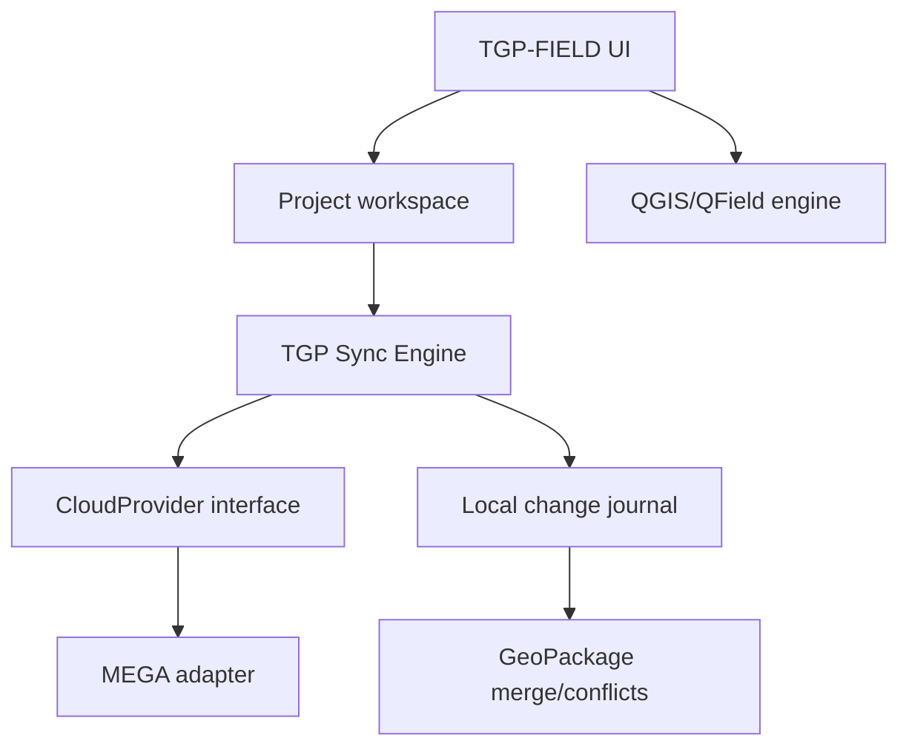

# TGP-FIELD — arhitectură inițială

## Identitate

- Aplicație: **TGP-FIELD**
- Android application ID: `ro.tgp.field`
- iOS bundle ID: `ro.tgp.field`
- Motor: fork QField, cu atribuirea și obligațiile GPL păstrate
- Brand propriu: TerraGIS Pro; nu reutilizează identitatea vizuală Mergin Maps sau QField

## Experiența produsului

Structura urmărește tiparul consacrat al aplicațiilor GIS de teren, fără copierea interfeței:

1. **Autentificare** — sesiune TGP și conectare separată la furnizorul cloud.
2. **Proiectele mele** — proiecte descărcate, stare offline, spațiu ocupat și ultima sincronizare.
3. **Catalog cloud** — proiecte disponibile pentru utilizator și descărcare locală.
4. **Hartă** — captură punct/linie/poligon, formulare QGIS, foto, GNSS și lucru complet offline.
5. **Centru de sincronizare** — progres, fișiere schimbate, conflicte și jurnal auditabil.
6. **Istoric proiect** — versiuni TGP, autor, dată și posibilitate de restaurare controlată.

## Straturi tehnice



## Componente construite

| Componentă | Responsabilitate | Expunere |
|---|---|---|
| `TgpFieldServices` | compune și deține serviciile TGP | context QML `tgpField` |
| `OfflineProjectExporter` | snapshot `.qgz/.qgs`, GeoPackage, atașamente, manifest și arhivă | `tgpField.offlineExporter` |
| `OfflineExportQueue` | coadă JSON persistentă, scrisă atomic cu `QSaveFile` | intern |
| `SyncEngine` | reîncercări, stări, progres și procesarea secvențială a joburilor | `tgpField.syncEngine` |
| `CloudProvider` | contract independent de furnizor | intern |
| `MegaCloudProvider` | limita de integrare cu SDK-ul MEGA | `tgpField.cloudProvider` |

Stările stabile ale unui export sunt: `preparing`, `waiting_for_network`,
`uploading`, `verifying`, `complete`, `failed` și `cancelled`.

`MegaCloudProvider` are două moduri de compilare. Implicit, `sdkAvailable` este
`false`, iar interfața explică faptul că installerul nu include SDK-ul. Cu
`TGP_WITH_MEGA_SDK=ON`, adaptorul folosește ținta oficială `MEGA::SDKlib`, cere
un App Key la build, autentifică utilizatorul și reia sesiunea salvată.
Parola există doar pe durata apelului de login; nu este persistentă.

Sesiunea MEGA este păstrată prin `QgsAuthManager`, iar în `QSettings` rămâne
doar identificatorul configurației securizate și adresa de email. Uploadul și
crearea automată a arborelui remote rămân etapa următoare; interfața nu marchează
un transfer ca finalizat înainte de implementarea și confirmarea SDK.

### CloudProvider

Adaptorul oferă `authenticate`, `listProjects`, `downloadSnapshot`, `uploadObject`, `moveObject`, `deleteObject` și `getMetadata`. Codul UI nu cunoaște MEGA direct.

### Modelul proiectului cloud

```text
/TGP-FIELD/<workspace>/<project-id>/
  manifest.json
  snapshots/<version-id>/project.zip
  objects/<sha256>
  changes/<device-id>/<sequence>.json
  locks/
```

`manifest.json` păstrează versiunea curentă, hash-urile, dimensiunile și schema. Fișierele sunt transferate prin MEGA; versionarea logică și rezolvarea conflictelor aparțin TGP Sync Engine.

## Reguli de sincronizare

- Descărcarea inițială produce un snapshot local verificat prin SHA-256.
- Modificările sunt scrise întâi local, într-un jurnal; conexiunea la internet nu este necesară în teren.
- La sincronizare se compară versiunea de bază, versiunea cloud și modificările locale.
- Atașamentele noi sunt content-addressed și se urcă o singură dată.
- Pentru GeoPackage se face îmbinare la nivel de entitate doar după introducerea unui identificator UUID stabil și a metadatelor de editare.
- Conflictele care nu pot fi îmbinate automat sunt păstrate, nu suprascrise, și sunt prezentate utilizatorului.
- Tokenurile MEGA sunt stocate numai în Android Keystore / iOS Keychain, niciodată în proiect sau în Git.

## Export offline QGIS + GeoPackage în MEGA

Acesta este un flux obligatoriu TGP-FIELD:

1. Utilizatorul lucrează fără internet; editările rămân în GeoPackage și atașamentele rămân local.
2. La „Exportă în MEGA”, aplicația salvează proiectul QGIS și finalizează tranzacțiile GeoPackage/WAL.
3. Se creează un snapshot imuabil `.tgpfield.zip`, fără a arhiva baza de date cât timp este scrisă.
4. Pachetul este verificat cu SHA-256 și adăugat într-o coadă persistentă de upload.
5. Dacă nu există internet, jobul rămâne `waiting_for_network`; închiderea aplicației sau repornirea telefonului nu îl pierd.
6. Când conexiunea revine, adaptorul MEGA reia transferul și publică manifestul numai după upload complet.
7. Ulterior, arhiva se descarcă, se extrage și `project.qgz` se deschide direct în QGIS; căile către `.gpkg` și `attachments/` sunt relative.

```text
<project-name>_<UTC timestamp>_<version>.tgpfield.zip
  project.qgz
  data/<one-or-more>.gpkg
  attachments/
  styles/
  manifest.json
  README.txt
```

Locația implicită în MEGA este:

```text
/TGP-FIELD/<workspace>/<project-id>/exports/<version-id>/<archive>
```

Se păstrează separat snapshotul local până când MEGA confirmă transferul și hash-ul. Utilizatorul poate alege „Păstrează pe dispozitiv” sau curățarea automată după confirmare.

## Etape

1. Branding, package/bundle ID și build-uri semnate.
2. Ecran Proiectele mele + import/export ZIP local.
3. Adaptor MEGA, autentificare securizată și sincronizare snapshot pentru un singur utilizator.
4. Jurnal incremental, coadă offline și reluarea transferurilor.
5. Colaborare multi-utilizator, conflicte GeoPackage și istoric.
6. Portal web TGP pentru administrare, roluri și audit.

MEGA este depozit de obiecte, nu oferă singur semantica de sincronizare GIS colaborativă. Etapele 4–5 necesită motorul TGP de versionare și merge.
